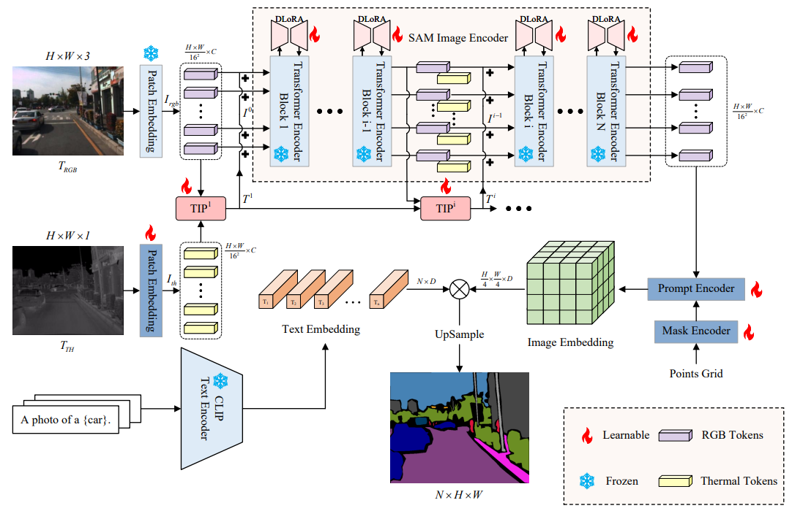
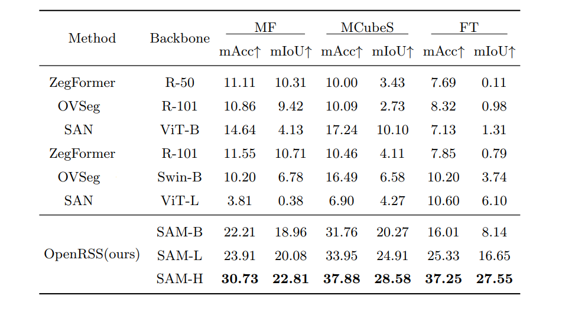

# Open-Vocabulary RGB-Thermal Semantic Segmentation  


This is the official repository of our paper:

**Abstract:** RGB-Thermal (RGB-T) semantic segmentation is an important research branch of multi-modal image segmentation. The current RGB-T semantic segmentation methods generally have two unsolved and typical shortcomings. First, they do not have the open-vocabulary recognition ability, which significantly limits their application scenarios. Second, when fusing RGB and thermal images, they often need to design complex fusion network structures, which usually results in low network training efficiency. We present OpenRSS, the **Open**-vocabulary **R**GB-T **S**emantic **S**egmentation method, to solve these two disadvantages. To our knowledge, OpenRSS is the first RGB-T semantic segmentation method with open-vocabulary segmentation capability. OpenRSS modifies the basic segmentation model SAM for RGB-T semantic segmentation by adding the proposed thermal information prompt module and dynamic low-rank adaptation strategy to SAM. These designs effectively fuse the RGB and thermal information, but with much fewer trainable parameters than other methods. OpenRSS achieves the open-vocabulary capability by jointly utilizing the vision-language model CLIP and the modified SAM. Through extensive experiments, OpenRSS demonstrates its effective open-vocabulary semantic segmentation ability on RGB-T images. It outperforms other state-of-the-art RGB open-vocabulary semantic segmentation methods on multiple RGB-T semantic segmentation benchmarks: +12.1% mIoU on the MFNet dataset, +18.4% mIoU on the MCubeS dataset, and +21.4% mIoU on the Freiburg Thermal dataset. 



# Installation

## Requirements

- PyTorch 1.11.0

- Python 3.8(ubuntu20.04)

- Cuda 11.3

## Install required packages

```python
pip install -r requirements.txt
```

# Dataset

Download datasets and place them in 'datasets' folder in the following structure:

- [MFNet dataset](https://www.mi.t.u-tokyo.ac.jp/static/projects/mil_multispectral/)
- [MCubeS dataset](https://vision.ist.i.kyoto-u.ac.jp/)
- [KP dataset](https://github.com/SoonminHwang/rgbt-ped-detection)
- [FT dataset](http://thermal.cs.uni-freiburg.de/)

```
<datasets>
|-- <MFdataset>
    |-- <images>
    |-- <labels>
    |-- train.txt
    |-- val.txt
    |-- test.txt
    ...
|-- <MCUbeSdataset>
    |-- <list_folder>
    |-- <NIR_warped>
    |-- <poIL_color>
    |-- <SSGT4MS>
    ...
|-- <KPdataset>
    |-- <images>
        |-- set00
        |-- set01
        ...
    |-- <labels>
    |-- train.txt
    |-- val.txt
    |-- test.txt
    ...
|-- <FTdataset>
    |-- <test>
        |-- <label>
        |-- <rgb>
        |-- <th>
    ...
```


# Training

```python
python train_KP.py -dr [data_dir] -ls 0.0005 -b 4 -em 300
```

# Evaluation

```python
python own_MF.py -dr [data_dir] -d [test] -f best.pth
python own_FT.py -dr [data_dir] -d [test] -f best.pth
python own_MCubeS.py -dr [data_dir] -d [test] -f best.pth
```

# RESULTS




# Code and checkpoints

Coming soon!